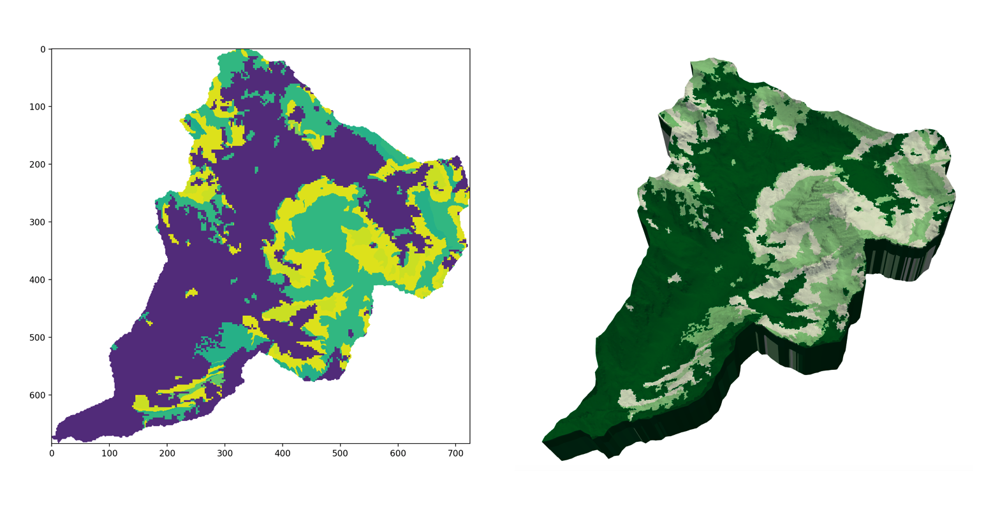

# 

----------------------------------------

## Introduction

TINerator is a tool for the fast creation of extruded and refined meshes from DEM and GIS data, developed at Los Alamos National Laboratory to aid in hydrogeological simulations.

TINerator allows a user to define a bounding box of latitude/longitude coordinates, a shapefile, or a local DEM, and generate a surface or volume mesh.

The mesh will have the topology of the DEM, along with user-defined material IDs and depths for stacked layers. Further, TINerator performs watershed delination on the defined DEM and refines the mesh’s elements around the feature to a user-defined length scale.

TINerator comes with a host of 2D and 3D visualization functions, allowing the user to view the status of the mesh at every step in the workflow. In addition, there are geometrical tools for removing triangles outside of a polygon, generating quality analytics on the mesh, adding cell- and node-based attributes to a mesh, and much more.

