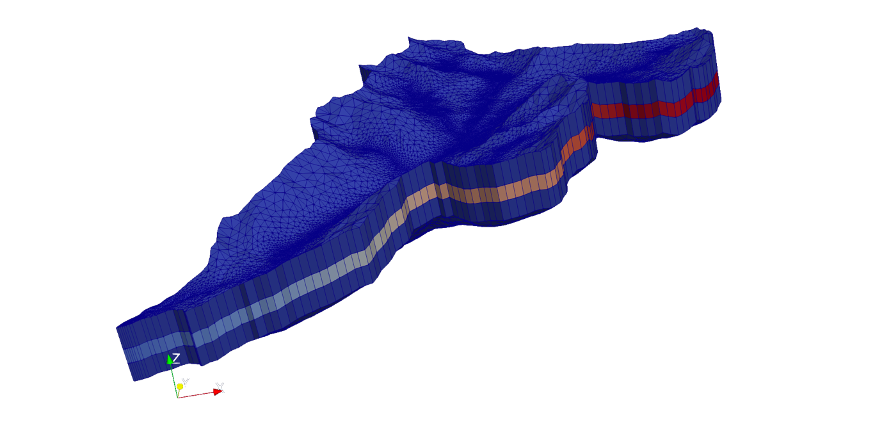

# Adding an Attribute

Cell and node based attributes can be added to a stacked mesh - 
the attributes can be added either globally, across all layers, or local to 
one or more layers.


*<b>Left:</b> Soil map as read from an ASC file.
<b>Right:</b> Soil map selectively applied to TIN layers.*

## Reading and applying an attribute
### Basic syntax

To add an attribute to a layered TIN, use the command:

```python
DEM.add_attribute(data,layers=[],dtype=int)
```

where `layers` is a list containing all layers to apply the attribute to,
and `dtype` is the desired attribute type (`int` or `float`). By default, the material will be applied to the mesh's material ID (or, 'cell color'). This can be changed with the `name` parameter.

As an example, consider a stacked mesh with three layers and an arbitrary
floating point attribute. To apply that attribute *only* to the second layer:

```python
my_dem.add_attribute(data,layers=[2],dtype=float)
```



By default, `layers = None`. This applies the attribute raster to every layer
of the mesh.

!!! note
    Any number of attribute rasters can be applied to a mesh, as long as each
    is given a unique name.

### Attribute Format

Attributes must fundamentally be an $N\times M$ Numpy matrix. The dimensions of
the matrix do not necessarily have to be the same as those of the DEM.

The `data` argument of `addAttribute` must be of type `np.ndarray`. To import
or convert from popular file formats, a table of functions is given below. Click
the function name to be redirected to its documentation.

| Data type                               | Import function                                                                                          |
|-----------------------------------------|----------------------------------------------------------------------------------------------------------|
| GIS rasters (`.asc`, `.tif`, ...)       | [`gdal.Open(file)`](https://gdal.org/python/osgeo.gdal-module.html#Open)                                 |
| Plain-text matrix (`.txt`, `.dat`, ...) | [`numpy.loadtxt(file)`](https://docs.scipy.org/doc/numpy-1.13.0/reference/generated/numpy.loadtxt.html)  |
| Python list                             | [`np.array(list)`](https://docs.scipy.org/doc/numpy-1.15.0/reference/generated/numpy.array.html)         |
| HDF5 (`.h5`)                            | [`h5py.File(file,'r')`](http://docs.h5py.org/en/2.9.0/high/file.html)                                    |

Note that when attributes are applied in TINerator, their domain spans that of
the parent DEM. In other words, it is assumed that the `data` matrix has
the same lower-left and upper-right corners as the DEM it is being applied
to.

### Considering Data Types

As mesh nodes will not necessarily align within cell centers of attribute raster,
interpolation on that raster is performed.

Based on the argument `dtype`, interpolation onto the mesh nodes will either be
continuous (`float`) or nearest-neighbor (`int`). This is critical for properties
such as soil ID, which only hold value as defined integers.

## Applying a function

Assume that an attribute has been applied across all layers of the mesh.
In some situations, it may be beneficial to change the attribute values
based on the layer ID.

The below method maps a user-defined function and operator onto mesh data:


```python
tinerator.DEM.map_function_to_attribute(self,operator='+',layers=None,
                                        attribute_name=None,outfile=None,
                                        fn=lambda layer: layer*100)
```

In other words, the new attribute data will be a result of:

$$ A_{i,j}(layer) = A_{i,j} \: [operation] \: f(layer) \: \forall \: i,j $$

where $A_{i,j}$ is the attribute raster data at index $i,j$.

### Example

Assume that we have soil types with unique values `[1,3,5,10,12...]`, applied 
to all layers of some mesh.
To better define, say, porosity as a function of layer in our simulation,
we would like to prefix each value with the layer ID.

In other words, changing 

        layer 1: [1,3,5,10,12...]
        layer 2: [1,3,5,10,12...]
        layer 3: [1,3,5,10,12...]
        ... 

to

        layer 1: [101,103,105,110,112...]
        layer 2: [201,203,205,210,212...]
        layer 3: [301,103,305,310,312...]
        ... 

This can be accomplished by using the following function:

$$ A_{i,j}(layer) = A_{i,j} + 100 \cdot layer \: \forall \: i,j $$

That is, adding $100 \cdot layer_{ID}$ to every attribute data point.

Consequently, we want the operator to be $+$ and $f(layer) = 100 \cdot layer$, or,

```python
my_dem.map_function_to_attribute(attribute_name='exampleAttribute',
                                 operator='+',
                                 fn=lambda layer: layer*100)
```


